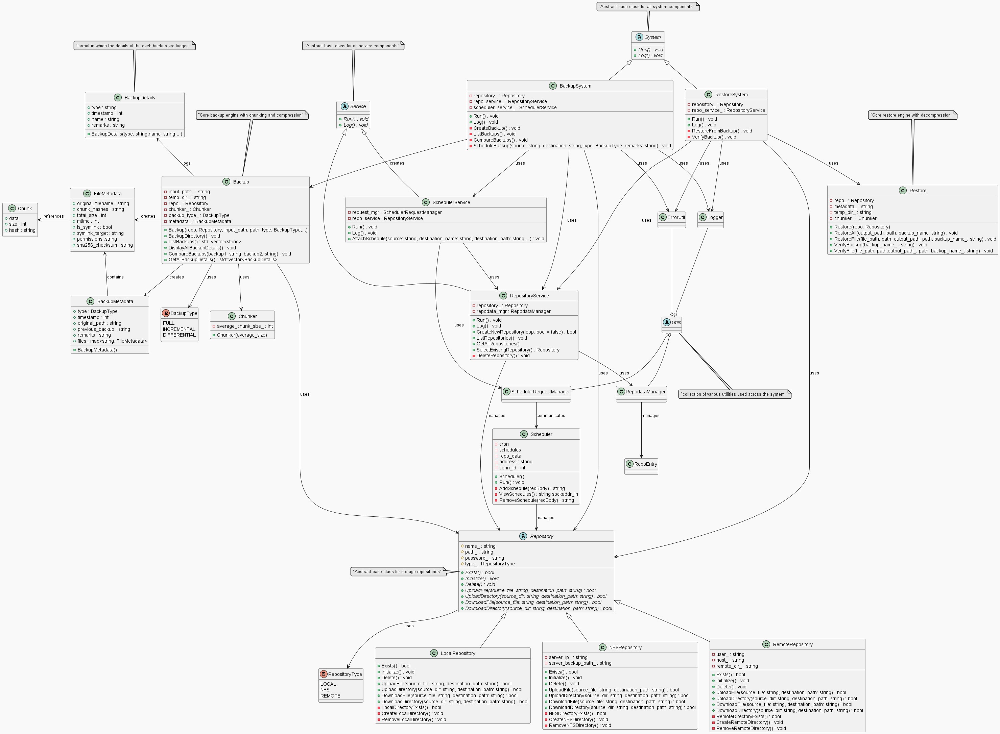
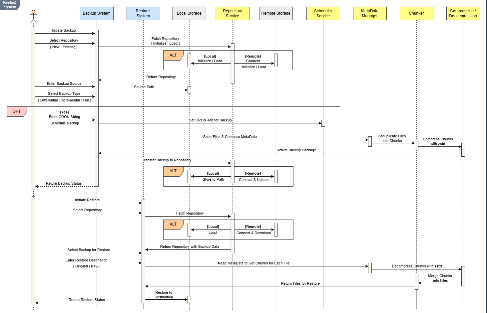
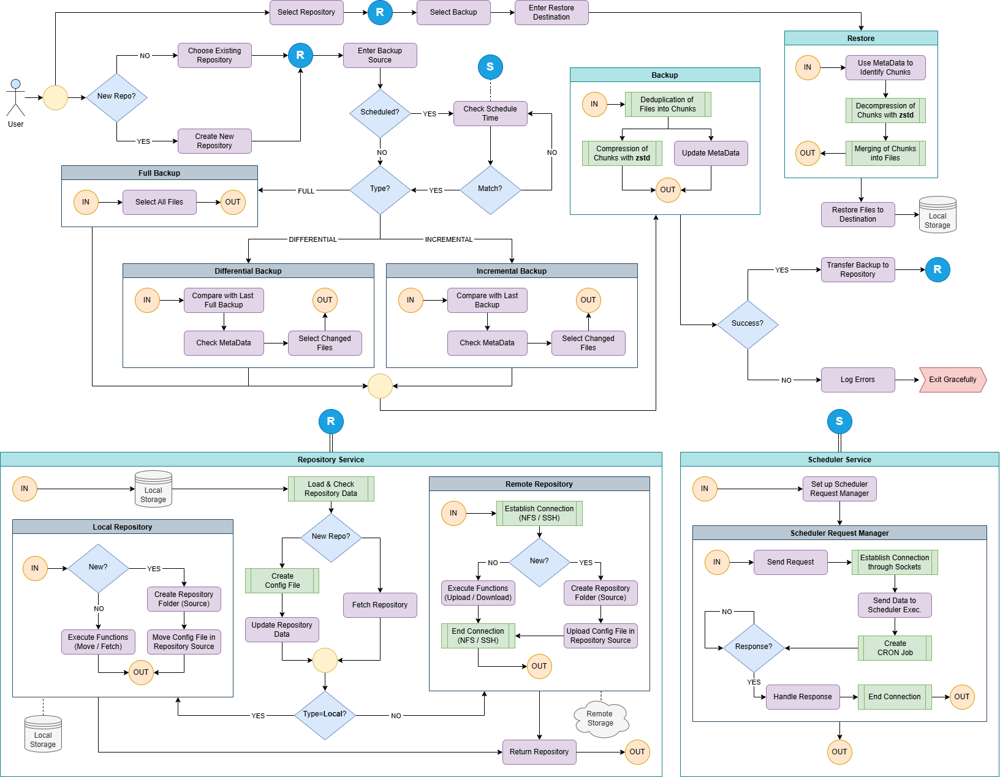

# ResilioZ: A Backup and Restore System for Linux

**ResilioZ** is a file-level backup and recovery system for Linux, engineered to provide secure, space-efficient, and reliable data protection in enterprise environments. The system supports full, incremental, and differential backup strategies through content-defined chunking (FastCDC), deduplication, Zstandard compression, and AES-256 encryption. The solution is designed to work seamlessly across local filesystems and remote servers, allowing flexible deployment in diverse environments.

Built as a part of HPE CPP 2025 (Project ID: 62)

<div style="background-color: white; padding: 16px;">  </div>

## Installation

### Prerequisites

First, ensure your system has the required build tools and development libraries. On a Debian-based system (like Ubuntu), you can install them with:

```bash
sudo apt update
sudo apt install cmake g++ build-essential git pkg-config \
    libssl-dev libzstd-dev zlib1g-dev \
    libnfs-dev libssh-dev \
    qt6-base-dev libxkbcommon-dev
```

### Build from Source

- Clone the repository and build the project using CMake.

    ```bash
    # Clone the repository
    git clone <your-repo-url>
    ```

- Use the provided shell script to automate the build and run process:
    ```bash
    chmod +x run.sh
    sudo ./run.sh
    ```

The compiled binaries will be located in the `build/` directory.

## Getting Started: Basic Usage

ResilioZ operates through an interactive, menu-driven CLI or a GUI. The following commands launch the interactive session.

1.  **Initialize a Repository**
    A repository is where your backup data is stored. You only need to do this once. The command will launch the interactive menu to guide you through selecting a repository type (Local, NFS, or Remote) and setting a password.

    ```bash
    # Launch the application to access the CLI or GUI
    sudo ./build/main [--cli (or) --gui]
    ```
    *From the menu, select "Others" -> "Repository Service" -> "Create New Repository".*

2.  **Create a Backup**
    Once a repository is selected, you can back up files or directories.

    *From the main menu, select "Backup System" and follow the prompts to choose a source path, backup type (Full, Incremental, Differential), and add optional remarks.*

3.  **List and View Backups**
    You can browse existing backups to see their timestamps, types, and contents.

    *From the main menu, select "Restore System" -> "List available backups".*

4.  **Restore Data from a Backup**
    Restore your files to their original location or a new directory.

    *From the "Restore System" menu, select a backup to restore from and choose a destination path. The system will reconstruct the files and verify their integrity.*

## External Repository Setup

### NFS Repository

#### NFS Server Setup:

1. Install the NFS Server:  
   ```bash
   sudo apt install nfs-kernel-server
    ```

2. Edit the exports file to define shared directories:

   ```bash
   sudo nano /etc/exports
   ```

3. Add a line for the directory you want to share:

   ```
   /path/to/backup [IP Address or hostname or *(for all IPs)](rw,sync,no_subtree_check,no_root_squash)
   ```

4. Apply the new export rules:

   ```bash
   sudo exportfs -ra
   ```

5. Set permissions on the shared directory:

   ```bash
   sudo chmod -R 777 /path/to/backup
   ```

#### NFS Client Setup:

1. Install client utilities:

   ```bash
   sudo apt install nfs-common
   ```

---

### Remote Repository

#### SSH Server Setup:

1. Install SSH Server:

   ```bash
   sudo apt install openssh-server
   ```

2. Enable the SSH Server:

   ```bash
   sudo systemctl enable ssh
   ```

3. Edit the configuration file `/etc/ssh/sshd_config` and ensure the following lines are present:

   ```plaintext
   PubkeyAuthentication yes
   AuthorizedKeysFile .ssh/authorized_keys
   ```

4. Restart the SSH Server:

   ```bash
   sudo systemctl restart ssh
   ```

#### SSH Client Setup:

1. Install SSH Client:

   ```bash
   sudo apt install openssh-client
   ```

2. Ensure the `.ssh` directory exists and has appropriate permissions:

   ```
   /home/[username]/.ssh
   ```

3. Generate an SSH key on your client system:

   ```bash
   ssh-keygen -t rsa -b 4096 -C "identifier"
   ```

4. Copy the public key to the server's `authorized_keys` file:

   ```bash
   ssh-copy-id username@[server IP or hostname]
   ```


## Features

*   **Multiple Backup Types**: Full, incremental, and differential backup strategies with intelligent change detection based on file size and modification time.
*   **Advanced Deduplication**: Employs the FastCDC algorithm to split files into variable-sized chunks based on content, maximizing data deduplication across all backups in a repository.
*   **High-Speed Compression**: Integrates Zstandard (ZSTD) for a superior balance of compression speed and ratio, significantly reducing the size of stored data.
*   **Robust Encryption**: Secures all backup metadata with AES-256 encryption. The encryption key is derived from the repository password using PBKDF2, protecting against unauthorized access.
*   **Verifiable Data Integrity**: Uses SHA256 checksums at the file level to verify data integrity during restore operations, ensuring backups are trustworthy.
*   **Flexible Repository Support**: Seamlessly works with multiple storage backends:
    *   **Local**: For direct, high-performance on-disk backups.
    *   **NFS**: For centralized backup storage on a LAN.
    *   **SSH/SFTP**: For secure, remote, and off-site backups.
*   **Automated Scheduling**: A client-server daemon uses `libcron` to run scheduled backups with full cron expression support, enabling reliable, automated data protection.
*   **Dual User Interfaces**:
    *   **CLI**: A powerful, menu-driven command-line interface for advanced users and scripting.
    *   **GUI**: A full-featured, intuitive Graphical User Interface built with Qt for ease of use.
*   **Streaming Restore**: Efficiently restores large files without requiring excessive memory by streaming data chunk by chunk.
*   **Full Metadata Preservation**: Restores files with their original permissions, timestamps, and symbolic links.

## Architecture and Workflow

ResilioZ adopts a modular architecture, encompassing components for backup, restore, repository management, and automated scheduling. The Repository Service abstracts storage operations and enforces password-based access control. Complementing this, a centralized metadata registry improves performance during lookups and access verification. The scheduler operates as a background daemon using cron expressions to automate routine backups.

### System Diagrams

#### Class Diagram

<div>  </div>

#### Sequence Diagram

<div>  </div>*

#### Workflow Diagram

<div>  </div>

## References

ResilioZ is built on the shoulders of giants. We would like to acknowledge the excellent open-source libraries that make this project possible:

*   **OpenSSL**: For cryptography (AES & SHA256).
*   **Zstandard**: For real-time data compression.
*   **libnfs**: For NFS client functionality.
*   **libssh**: For SSH/SFTP client functionality.
*   **libcron**: For cron-based job scheduling.
*   **nlohmann/json**: For modern C++ JSON support.
*   **Qt**: For the cross-platform Graphical User Interface.
*   **FastCDC**: The basis for our content-defined chunking, as described in the [USENIX ATC '16 paper](https://www.usenix.org/system/files/conference/atc16/atc16-paper-xia.pdf).